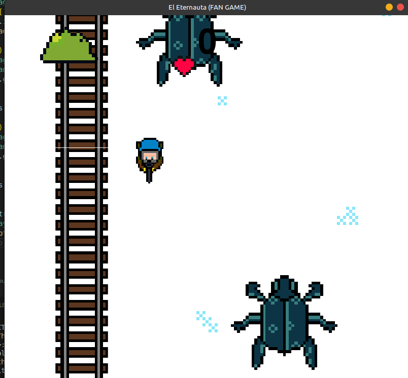
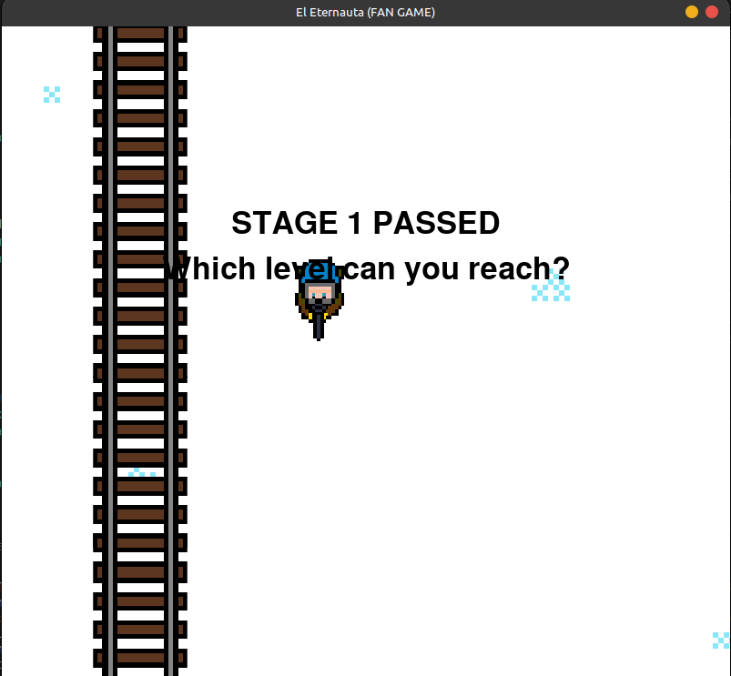

# The Eternaut (PC ONLY)
##### Created by `msardina`

After months I present... The Eternaut 

A fan-game based on the Argentine movie and comic "The Eternaut". No rights towards the movie or book are taken in this game. This is only a fan game.

## How to Play

The game's controls are very easy with only 5 buttons to manage. The directional keys to steer the player (Juan) around. And the space bar to shoot at the incoming spiders.

The spiders will automatically come to you which means you have to quickly dodge and escape all the enemies. You only have three lives so try not to waste them.

Every 300 points you will continue to the next stage where the game gets proggresivly harder.

## Story

A deadly snow has come to Earth killing thousands if not millions of people. Juan survived with a mask to not inhale the snow in his lungs. Aliens that look like big spiders are attacking to kill all the surviving people. You must kill them all.

## Snapshots

Snapshot 1:
- 

Snapshot 2:
- 

Snapshot 3:
- 

## Credits

Code - 100% by `msardina`

Art - 95% by `msardina` (All art except for spider and Juan)

Sound - 100% by `msardina`

Support + Ideas - 100% by `ssardina`