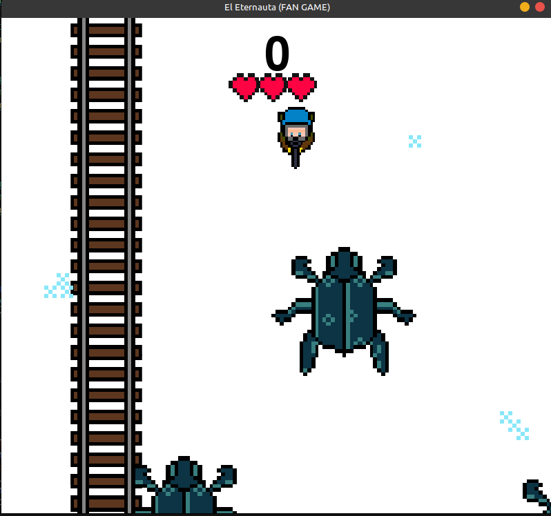

# The Eternaut (PC ONLY)
##### Created by `msardina`

After months I present... The Eternaut 

A fan-game based on the 1957 Argentine comic by [Héctor Germán Oesterheld](https://en.wikipedia.org/wiki/H%C3%A9ctor_Germ%C3%A1n_Oesterheld) and [Francisco Solano López](https://en.wikipedia.org/wiki/Francisco_Solano_L%C3%B3pez_(comics)).

More about the movie adaptation [here](https://en.wikipedia.org/wiki/The_Eternaut_(TV_series))

## How to Play

The game's controls are very easy with only 5 buttons to manage. The directional keys to steer the player (Juan) around. And the space bar to shoot at the incoming spiders.

The spiders will automatically come to you which means you have to quickly dodge and escape all the enemies. You only have three lives so try not to waste them.

Every 300 points you will continue to the next stage where the game gets proggresivly harder.

## Story

A deadly snow has come to Earth killing thousands if not millions of people. Juan survived with a mask to not inhale the snow in his lungs. Aliens that look like big spiders are attacking to kill all the surviving people. You must kill them all.

## Snapshots
Snapshot 2:
- 
- 
## Credits

Code -  `msardina`

Art - `msardina` + inspiration from [Lomas de Zamora](https://launion.com.ar/nota/47650/2025/05/furor-por-el-eternauta--crean-un-videojuego-con-juan-salvo-favalli-y-compania)

Sound - `msardina`
